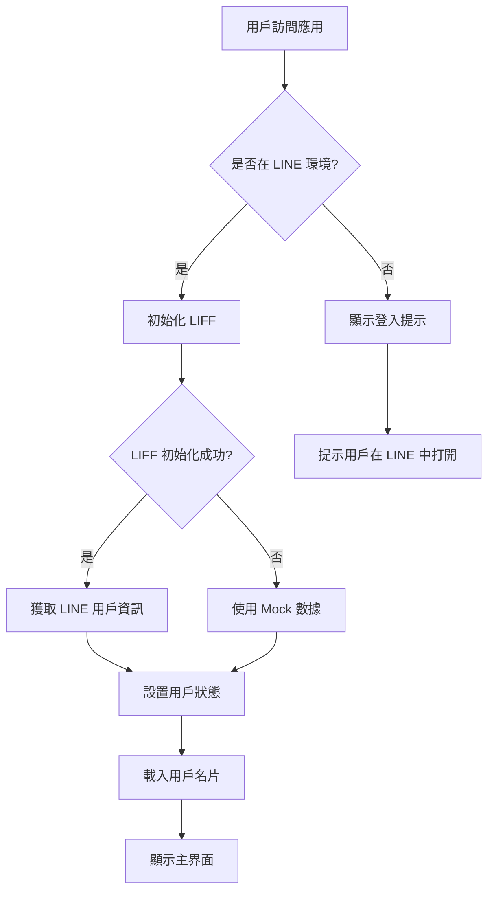
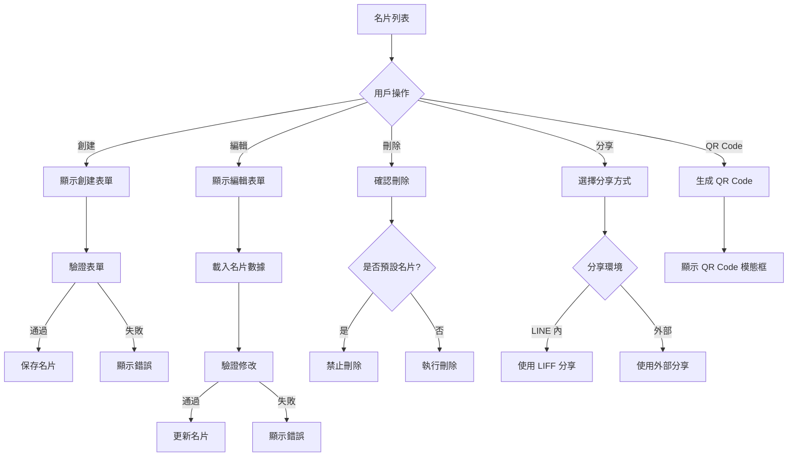
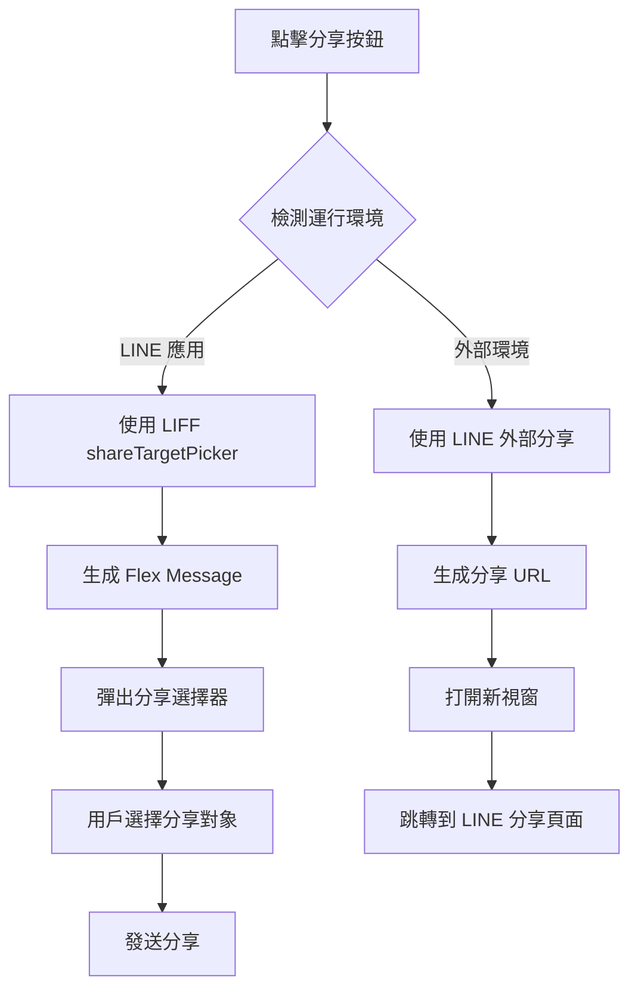

# 電子名片管理系統 - 規格文件設計稿

## 1. 系統架構設計

### 1.1 整體架構

```
┌─────────────────────────────────────────────────────────────┐
│                        前端應用層                              │
├─────────────────────────────────────────────────────────────┤
│  React 18 + TypeScript + Vite + Zustand                    │
│  ├── 用戶界面組件 (Components)                              │
│  ├── 狀態管理 (Store)                                      │
│  ├── 服務層 (Services)                                     │
│  └── 類型定義 (Types)                                      │
├─────────────────────────────────────────────────────────────┤
│                        LINE LIFF 平台                        │
│  ├── 用戶認證 (Authentication)                             │
│  ├── 分享功能 (Sharing)                                    │
│  └── 環境檢測 (Environment Detection)                      │
├─────────────────────────────────────────────────────────────┤
│                        數據層                                │
│  ├── Mock API (開發階段)                                   │
│  ├── 本地存儲 (Local Storage)                              │
│  └── 後端 API (生產環境)                                   │
└─────────────────────────────────────────────────────────────┘
```

### 1.2 技術架構

#### 1.2.1 前端技術棧
- **框架**: React 18 (函數式組件 + Hooks)
- **語言**: TypeScript 5.2+
- **構建工具**: Vite 5.0+
- **狀態管理**: Zustand 4.4+
- **樣式**: 原生 CSS + CSS 變量
- **QR Code**: qrcode.react 3.1+
- **LINE 整合**: @line/liff 2.21+

#### 1.2.2 開發工具
- **代碼檢查**: ESLint + TypeScript ESLint
- **格式化**: Prettier
- **打包**: Capacitor (移動端)
- **版本控制**: Git

### 1.3 組件架構

```
src/
├── components/                    # React 組件
│   ├── BusinessCardComponent.tsx  # 名片展示組件
│   ├── CardEditor.tsx            # 名片編輯組件
│   ├── CardList.tsx              # 名片列表組件
│   ├── QRCodeModal.tsx           # QR Code 模態框
│   ├── SmartShareButton.tsx      # 智能分享按鈕
│   ├── LoadingSpinner.tsx        # 載入動畫
│   └── ErrorMessage.tsx          # 錯誤訊息
├── services/                     # 服務層
│   ├── mockApi.ts               # 模擬 API
│   └── lineService.ts           # LINE 服務
├── store/                       # 狀態管理
│   └── userStore.ts            # 用戶狀態
├── types/                       # 類型定義
│   └── card.ts                 # 名片類型
├── App.tsx                     # 主應用
├── main.tsx                    # 入口點
└── index.css                   # 全局樣式
```

## 2. 數據模型設計

### 2.1 核心實體

#### 2.1.1 用戶實體 (User)
```typescript
interface User {
  id: string;                    // 用戶唯一標識
  lineUserId: string;           // LINE 用戶 ID
  displayName: string;          // 顯示名稱
  pictureUrl?: string;          // 頭像 URL
  statusMessage?: string;       // 狀態訊息
  isLoggedIn: boolean;          // 登入狀態
}
```

#### 2.1.2 名片實體 (BusinessCard)
```typescript
interface BusinessCard {
  id: string;                   // 名片唯一標識
  userId: string;              // 所屬用戶 ID
  name: string;                // 姓名 (必填)
  title: string;               // 職稱 (必填)
  company: string;             // 公司 (必填)
  email: string;               // 電子郵件 (必填)
  phone: string;               // 電話 (必填)
  address?: string;            // 地址 (選填)
  website?: string;            // 網站 (選填)
  avatar?: string;             // 頭像 (選填)
  isPublic: boolean;           // 公開狀態
  isDefault: boolean;          // 是否為預設名片
  createdAt: string;           // 創建時間
  updatedAt: string;           // 更新時間
}
```

#### 2.1.3 Flex Message 實體
```typescript
interface FlexMessage {
  type: 'flex';
  altText: string;
  contents: FlexBubble;
}

interface FlexBubble {
  type: 'bubble';
  header?: FlexBox;
  hero?: FlexBox;
  body?: FlexBox;
  footer?: FlexBox;
}
```

### 2.2 狀態管理模型

#### 2.2.1 全局狀態 (UserState)
```typescript
interface UserState {
  user: User | null;           // 當前用戶
  cards: BusinessCard[];       // 用戶名片列表
  isLoading: boolean;          // 載入狀態
  error: string | null;        // 錯誤訊息
  
  // Actions
  setUser: (user: User) => void;
  logout: () => void;
  setCards: (cards: BusinessCard[]) => void;
  updateCard: (cardId: string, updates: Partial<BusinessCard>) => void;
  deleteCard: (cardId: string) => void;
  addCard: (card: BusinessCard) => void;
  setLoading: (loading: boolean) => void;
  setError: (error: string | null) => void;
}
```

## 3. API 設計規格

### 3.1 Mock API 接口

#### 3.1.1 用戶相關接口
```typescript
// 獲取當前用戶資訊
GET /api/user/current
Response: User

// 更新用戶資訊
PUT /api/user/current
Body: Partial<User>
Response: User
```

#### 3.1.2 名片相關接口
```typescript
// 獲取用戶名片列表
GET /api/cards
Query: { userId: string }
Response: BusinessCard[]

// 創建新名片
POST /api/cards
Body: Omit<BusinessCard, 'id' | 'createdAt' | 'updatedAt'>
Response: BusinessCard

// 更新名片
PUT /api/cards/:id
Body: Partial<BusinessCard>
Response: BusinessCard

// 刪除名片
DELETE /api/cards/:id
Response: void

// 切換名片可見性
PATCH /api/cards/:id/visibility
Response: BusinessCard
```

### 3.2 LINE LIFF API 整合

#### 3.2.1 LIFF 初始化
```typescript
// 初始化 LIFF
initializeLIFF(): Promise<boolean>

// 檢查 LINE 環境
isInLineApp(): boolean

// 獲取 LINE 用戶資訊
getLineProfile(): Promise<LineProfile | null>
```

#### 3.2.2 分享功能
```typescript
// 分享 Flex Message
shareLINEFlexMessage(card: BusinessCard): Promise<void>

// 生成 Flex Message
createBusinessCardFlexMessage(card: BusinessCard): FlexMessage
```

## 4. 用戶界面設計規格

### 4.1 設計原則

#### 4.1.1 視覺設計原則
- **簡潔性**: 界面簡潔清晰，避免不必要的元素
- **一致性**: 保持設計風格和交互模式的一致性
- **可讀性**: 確保文字清晰可讀，對比度適中
- **響應式**: 適配不同螢幕尺寸和設備

#### 4.1.2 交互設計原則
- **直觀性**: 操作流程直觀易懂
- **反饋性**: 提供及時的操作反饋
- **容錯性**: 支援操作撤銷和錯誤恢復
- **效率性**: 減少不必要的操作步驟

### 4.2 色彩規範

#### 4.2.1 主色調
```css
:root {
  /* 主色調 */
  --primary-color: #00B900;        /* LINE 綠色 */
  --primary-hover: #009900;        /* 主色調懸停 */
  
  /* 輔助色調 */
  --secondary-color: #3B82F6;      /* 藍色 */
  --success-color: #10B981;        /* 成功色 */
  --warning-color: #F59E0B;        /* 警告色 */
  --danger-color: #EF4444;         /* 危險色 */
  
  /* 中性色調 */
  --text-primary: #1F2937;         /* 主要文字 */
  --text-secondary: #6B7280;       /* 次要文字 */
  --text-muted: #9CA3AF;           /* 靜音文字 */
  
  /* 背景色調 */
  --bg-primary: #FFFFFF;           /* 主要背景 */
  --bg-secondary: #F9FAFB;         /* 次要背景 */
  --bg-muted: #F3F4F6;             /* 靜音背景 */
  
  /* 邊框色調 */
  --border-color: #E5E7EB;         /* 邊框色 */
  --border-focus: #3B82F6;         /* 聚焦邊框 */
}
```

#### 4.2.2 語義化色彩
- **成功**: 綠色系 (#10B981)
- **警告**: 橙色系 (#F59E0B)
- **錯誤**: 紅色系 (#EF4444)
- **信息**: 藍色系 (#3B82F6)

### 4.3 字體規範

#### 4.3.1 字體家族
```css
:root {
  --font-family: -apple-system, BlinkMacSystemFont, 'Segoe UI', 
                 'Roboto', 'Oxygen', 'Ubuntu', 'Cantarell', 
                 'Fira Sans', 'Droid Sans', 'Helvetica Neue', 
                 sans-serif;
  --font-family-mono: 'SF Mono', Monaco, 'Cascadia Code', 
                      'Roboto Mono', Consolas, 'Courier New', monospace;
}
```

#### 4.3.2 字體大小
```css
:root {
  --text-xs: 0.75rem;    /* 12px */
  --text-sm: 0.875rem;   /* 14px */
  --text-base: 1rem;     /* 16px */
  --text-lg: 1.125rem;   /* 18px */
  --text-xl: 1.25rem;    /* 20px */
  --text-2xl: 1.5rem;    /* 24px */
  --text-3xl: 1.875rem;  /* 30px */
  --text-4xl: 2.25rem;   /* 36px */
}
```

### 4.4 組件設計規格

#### 4.4.1 按鈕組件
```css
/* 主要按鈕 */
.btn-primary {
  background-color: var(--primary-color);
  color: white;
  padding: 0.75rem 1.5rem;
  border-radius: 0.5rem;
  border: none;
  font-weight: 500;
  cursor: pointer;
  transition: background-color 0.2s;
}

.btn-primary:hover {
  background-color: var(--primary-hover);
}

/* 次要按鈕 */
.btn-secondary {
  background-color: var(--bg-secondary);
  color: var(--text-primary);
  border: 1px solid var(--border-color);
  padding: 0.75rem 1.5rem;
  border-radius: 0.5rem;
  font-weight: 500;
  cursor: pointer;
  transition: all 0.2s;
}

.btn-secondary:hover {
  background-color: var(--bg-muted);
  border-color: var(--border-focus);
}
```

#### 4.4.2 卡片組件
```css
.business-card {
  background: var(--bg-primary);
  border: 1px solid var(--border-color);
  border-radius: 1rem;
  padding: 1.5rem;
  box-shadow: 0 1px 3px rgba(0, 0, 0, 0.1);
  transition: box-shadow 0.2s;
}

.business-card:hover {
  box-shadow: 0 4px 6px rgba(0, 0, 0, 0.1);
}
```

#### 4.4.3 表單組件
```css
.form-input {
  width: 100%;
  padding: 0.75rem;
  border: 1px solid var(--border-color);
  border-radius: 0.5rem;
  font-size: var(--text-base);
  transition: border-color 0.2s;
}

.form-input:focus {
  outline: none;
  border-color: var(--border-focus);
  box-shadow: 0 0 0 3px rgba(59, 130, 246, 0.1);
}
```

### 4.5 響應式設計規格

#### 4.5.1 斷點設定
```css
/* 移動設備 */
@media (max-width: 640px) {
  /* 手機樣式 */
}

/* 平板設備 */
@media (min-width: 641px) and (max-width: 1024px) {
  /* 平板樣式 */
}

/* 桌面設備 */
@media (min-width: 1025px) {
  /* 桌面樣式 */
}
```

#### 4.5.2 網格系統
```css
.card-grid {
  display: grid;
  gap: 1.5rem;
  grid-template-columns: 1fr;
}

@media (min-width: 768px) {
  .card-grid {
    grid-template-columns: repeat(2, 1fr);
  }
}

@media (min-width: 1024px) {
  .card-grid {
    grid-template-columns: repeat(3, 1fr);
  }
}
```

## 5. 功能流程設計

### 5.1 用戶登入流程



### 5.2 名片管理流程



### 5.3 分享功能流程



## 6. 錯誤處理設計

### 6.1 錯誤分類

#### 6.1.1 用戶錯誤
- **表單驗證錯誤**: 輸入格式不正確
- **操作權限錯誤**: 無權限執行操作
- **業務邏輯錯誤**: 違反業務規則

#### 6.1.2 系統錯誤
- **網路錯誤**: 連接失敗、超時
- **API 錯誤**: 服務端錯誤
- **環境錯誤**: LIFF 初始化失敗

#### 6.1.3 外部依賴錯誤
- **LINE 服務錯誤**: LIFF API 錯誤
- **瀏覽器錯誤**: 不支援的功能

### 6.2 錯誤處理策略

#### 6.2.1 錯誤捕獲
```typescript
try {
  // 執行操作
} catch (error) {
  // 錯誤處理
  if (error instanceof NetworkError) {
    // 網路錯誤處理
  } else if (error instanceof ValidationError) {
    // 驗證錯誤處理
  } else {
    // 通用錯誤處理
  }
}
```

#### 6.2.2 錯誤顯示
```typescript
// 錯誤訊息組件
const ErrorMessage: React.FC<{ message: string }> = ({ message }) => {
  return (
    <div className="error-message">
      <div className="error-icon">⚠️</div>
      <div className="error-text">{message}</div>
      <button className="error-retry">重試</button>
    </div>
  );
};
```

### 6.3 備用方案設計

#### 6.3.1 數據備用
- **本地存儲**: 使用 localStorage 備份數據
- **Mock 數據**: 提供開發和測試數據
- **離線模式**: 支援離線查看已載入的數據

#### 6.3.2 功能備用
- **分享備用**: 多種分享方式確保功能可用
- **認證備用**: 支援外部環境的模擬登入
- **API 備用**: 提供 Mock API 作為備用

## 7. 性能優化設計

### 7.1 載入優化

#### 7.1.1 代碼分割
```typescript
// 動態導入組件
const QRCodeModal = React.lazy(() => import('./QRCodeModal'));
const CardEditor = React.lazy(() => import('./CardEditor'));
```

#### 7.1.2 資源優化
- **圖片優化**: 使用適當的圖片格式和尺寸
- **字體優化**: 使用系統字體減少載入時間
- **CSS 優化**: 移除未使用的樣式

### 7.2 運行時優化

#### 7.2.1 狀態管理優化
```typescript
// 使用 Zustand 的選擇器優化重渲染
const user = useUserStore(state => state.user);
const cards = useUserStore(state => state.cards);
```

#### 7.2.2 組件優化
```typescript
// 使用 React.memo 避免不必要的重渲染
const BusinessCardComponent = React.memo(({ card }) => {
  // 組件邏輯
});
```

### 7.3 快取策略

#### 7.3.1 數據快取
- **用戶資訊快取**: 快取用戶基本資訊
- **名片數據快取**: 快取名片列表數據
- **API 響應快取**: 快取 API 響應結果

#### 7.3.2 資源快取
- **靜態資源快取**: 快取 CSS、JS 文件
- **圖片快取**: 快取用戶頭像和名片圖片
- **QR Code 快取**: 快取生成的 QR Code

## 8. 安全設計

### 8.1 數據安全

#### 8.1.1 輸入驗證
```typescript
// 表單驗證
const validateEmail = (email: string): boolean => {
  const emailRegex = /^[^\s@]+@[^\s@]+\.[^\s@]+$/;
  return emailRegex.test(email);
};

const validatePhone = (phone: string): boolean => {
  const phoneRegex = /^[\+]?[0-9\s\-\(\)]+$/;
  return phoneRegex.test(phone);
};
```

#### 8.1.2 數據清理
```typescript
// XSS 防護
const sanitizeInput = (input: string): string => {
  return input.replace(/[<>]/g, '');
};
```

### 8.2 認證安全

#### 8.2.1 LINE 認證
- **LIFF 驗證**: 確保 LIFF 初始化成功
- **用戶驗證**: 驗證 LINE 用戶身份
- **權限檢查**: 檢查用戶操作權限

#### 8.2.2 會話管理
- **登入狀態**: 維護用戶登入狀態
- **自動登出**: 處理登入過期
- **安全登出**: 清理用戶數據

### 8.3 隱私保護

#### 8.3.1 數據最小化
- **必要數據**: 只收集必要的用戶數據
- **數據匿名化**: 支援數據匿名化處理
- **數據刪除**: 支援用戶數據刪除

#### 8.3.2 權限控制
- **公開設定**: 用戶控制名片可見性
- **分享權限**: 控制分享範圍
- **數據訪問**: 限制數據訪問權限

## 9. 測試策略

### 9.1 單元測試

#### 9.1.1 組件測試
```typescript
// 組件測試示例
describe('BusinessCardComponent', () => {
  it('should render card information correctly', () => {
    const card = mockCard;
    render(<BusinessCardComponent card={card} />);
    expect(screen.getByText(card.name)).toBeInTheDocument();
  });
});
```

#### 9.1.2 服務測試
```typescript
// 服務測試示例
describe('mockApi', () => {
  it('should return user cards', async () => {
    const cards = await mockApi.getUserCards('user_001');
    expect(cards).toHaveLength(3);
  });
});
```

### 9.2 整合測試

#### 9.2.1 用戶流程測試
- **登入流程**: 測試完整的登入流程
- **名片管理**: 測試名片的 CRUD 操作
- **分享功能**: 測試各種分享方式

#### 9.2.2 API 整合測試
- **Mock API**: 測試 Mock API 功能
- **LINE 整合**: 測試 LINE LIFF 功能
- **錯誤處理**: 測試錯誤處理機制

### 9.3 端到端測試

#### 9.3.1 用戶場景測試
- **新用戶註冊**: 測試新用戶的完整流程
- **名片分享**: 測試名片分享的完整流程
- **多設備同步**: 測試多設備間的數據同步

#### 9.3.2 性能測試
- **載入性能**: 測試頁面載入時間
- **操作性能**: 測試用戶操作響應時間
- **記憶體使用**: 測試記憶體使用情況

## 10. 部署規格

### 10.1 環境配置

#### 10.1.1 開發環境
```bash
# 開發服務器
npm run dev

# 代碼檢查
npm run lint

# 類型檢查
npm run type-check
```

#### 10.1.2 生產環境
```bash
# 構建生產版本
npm run build

# 預覽生產版本
npm run preview

# Capacitor 構建
npm run cap:build
```

### 10.2 部署要求

#### 10.2.1 服務器要求
- **HTTPS**: 必須支援 HTTPS 協議
- **CORS**: 配置適當的 CORS 政策
- **壓縮**: 啟用 Gzip 壓縮
- **快取**: 配置適當的快取策略

#### 10.2.2 LINE LIFF 配置
- **LIFF ID**: 配置正確的 LIFF ID
- **Endpoint URL**: 設置正確的端點 URL
- **Scope**: 配置必要的權限範圍
- **Bot Link**: 設置機器人連結

### 10.3 監控和日誌

#### 10.3.1 性能監控
- **載入時間**: 監控頁面載入時間
- **錯誤率**: 監控錯誤發生率
- **用戶行為**: 監控用戶操作行為

#### 10.3.2 錯誤追蹤
- **錯誤日誌**: 記錄系統錯誤
- **用戶反饋**: 收集用戶反饋
- **性能指標**: 追蹤性能指標

## 11. 維護和更新

### 11.1 版本管理

#### 11.1.1 版本號規範
- **主版本號**: 重大功能更新
- **次版本號**: 新功能添加
- **修訂版本號**: 錯誤修復

#### 11.1.2 更新策略
- **向後相容**: 確保向後相容性
- **漸進式更新**: 採用漸進式更新策略
- **回滾機制**: 提供回滾機制

### 11.2 文檔維護

#### 11.2.1 技術文檔
- **API 文檔**: 維護 API 文檔
- **組件文檔**: 維護組件文檔
- **部署文檔**: 維護部署文檔

#### 11.2.2 用戶文檔
- **使用指南**: 提供用戶使用指南
- **常見問題**: 維護常見問題解答
- **更新日誌**: 記錄版本更新內容

### 11.3 社區支援

#### 11.3.1 問題追蹤
- **Issue 管理**: 管理 GitHub Issues
- **Bug 報告**: 處理 Bug 報告
- **功能請求**: 處理功能請求

#### 11.3.2 貢獻指南
- **代碼貢獻**: 提供代碼貢獻指南
- **文檔貢獻**: 提供文檔貢獻指南
- **測試貢獻**: 提供測試貢獻指南
